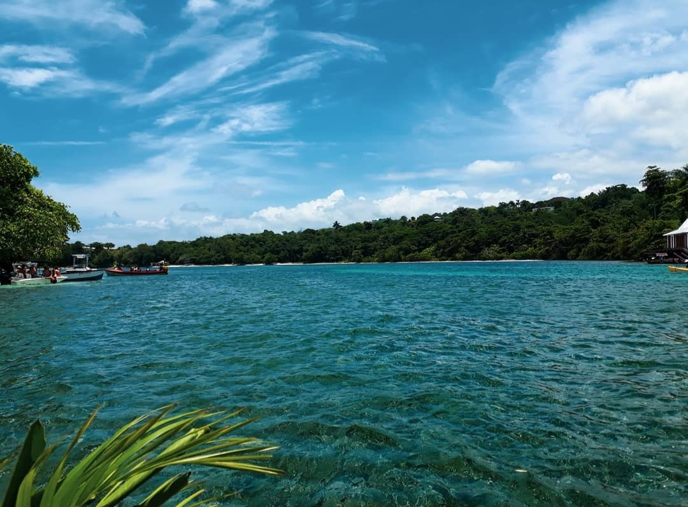

# Homework 1 Assignment
## Ebony Tempral

I'm from Jamaica and moved to Canada about 8 years ago. I also lived in New York as a kid for about 3 years. 
I'm a huge food enthusiast - I love cooking, baking and tasting dishes with complex flavour combinations. 
I originally studied Journalism and Communications but realized it wasn't my passion so I changed careers.
I've been enjoying this program so far and looking forward to learning more.

### Top 3 fun facts about me:
1. I've watched The Office and How I Met Your Mother over 10 times.
2. I can do a one-handed cartwheel.
3. I can move my ears.

### Here are some of my hobbies:
- Reading
- Listening to music
- Cooking and baking
- Amateur photography

### My Favourite Song Right Now
[Imogen Head - Headlock](https://www.youtube.com/watch?v=IXdIxKQ-qWQ)

Please enjoy this picture I took while rafting in Portland, Jamaica :D **THANK YOU**

## Justine Nathalie Ng

Hi! I am Justine Nathalie Ng. My nickname is Jus, I am from the Philippines and a Veterinarian. I am a Filipino but with Chinese blood. It's our first time to come and live in a different country aside from our country so it's considered a big move. So far we are enjoying the weather here in canada. I have a business back in the Philippines, it's an onsite souvenir business where I bring the crafts to the kids and they get to experience all sorts of activities. I am here because I wish to expand my knowledge in designing and product development. 

## Facts about Me

1. I am a LEGO collector and very addicted to it, I have tons of built figures on display back in the Philippines.
2. My weakness is all things cute and quirky.
3. I have an order OCD. I want my house and my stuffs to be kept in proper order, aligned and properly organized. 
4. My dream is to be a Panda caretaker.
5. I'm good with building and crafting stuffs. 

## Hobbies and Skills
1. Swimming and Paddleboarding
2. Sewing 
3. Shoe making
4. AFOL (Adult fan of Lego)

## Meet my kids.

Sharing it with you! They are Malchom and Maxwell. They are both 8 yrs old. They love Canada and the snowy weather.

## Installation
No installation required
## Usage
Open in browser of your choice
## Contributing
1. Justine and Ebony
2. Create your feature branch: `git checkout -b my-new-feature`
3. Commit your changes: `git commit -am 'Add some feature'`
4. Push to the branch: `git push origin my-new-feature`
5. Submit a pull request :D
## History
Submit a pull request
## Credits
Ebony Tempral and Justine Nathalie Ng
## License
See license file
